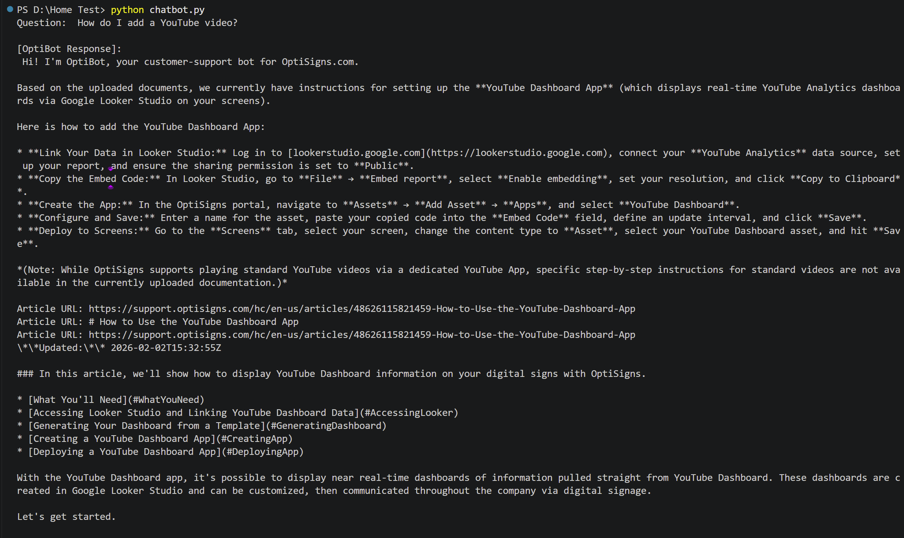

** OptiBot Mini Clone**
Daily scraper and Gemini File Search loader for OptiSigns support articles.

# Setup

1. Create a Google AI Studio API key.
2. Copy `.env.example` to `.env` and set `API_KEY`.
3. Install dependencies:

```bash
pip install -r requirements.txt
```
4. Ensure to have Docker installed if you want to run the bot in a container.

# Run Locally

Run once from Python:

```bash
python main.py
```

Or run once with Docker:

```bash
docker build -t optibot .
docker run -e API_KEY=YOUR_KEY_HERE optibot
```


# Google AI Studio Agent

In AI Studio, create a Playground chat/agent with this system prompt:

```text
You are OptiBot, the customer-support bot for OptiSigns.com.
* Tone: helpful, factual, concise.
* Only answer using the uploaded docs.
* Max 5 bullet points; else link to the doc.
* Cite up to 3 "Article URL:" lines per reply.
```

# Daily Job

`.github/workflows/daily_jobs.yml` runs the Docker job daily at 02:00 UTC and uploads
`last_run.txt` as the daily run artifact. Configure repository secrets:

```text
API_KEY
```

Each run re-scrapes articles, writes Markdown to `articles_markdown`, compares each
`slug_updatedTimestamp.md` against Gemini File Search documents, uploads only new or
updated files, and logs `added`, `updated`, `skipped`.

Chunking strategy: Gemini File Search automatically splits Markdown into chunks for embedding.

**Daily job logs**: 
Because of the requirment to connect with a personal billing account in most of hosting platforms and the limitations in public daily job log sharing, I created a public GitHub Actions workflow to run the daily job and upload the last run artifact. You can check the logs of the last run here:
- [Github Actions](https://github.com/DaoThiHaAn/Home-Test/actions)

**Screenshot for sanity check of the chatbot**: 
Because OpenAI platform also requires a personal billing account, I switched to Google AI Studio for the chatbot. However, Gemini File Search does still not support UI chatbot prompting with self-created File Search via API (It only provides file upload via drag-and-drop UI in each chat). Therefore, I created a simple sanity check for the chatbot in terminal. You can check the screenshot below:
```bash
python chatbot.py
```
